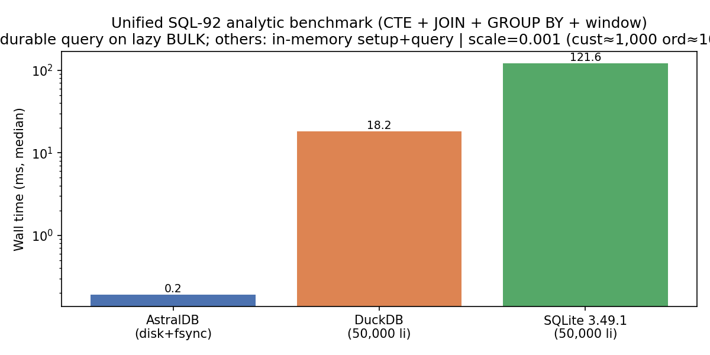
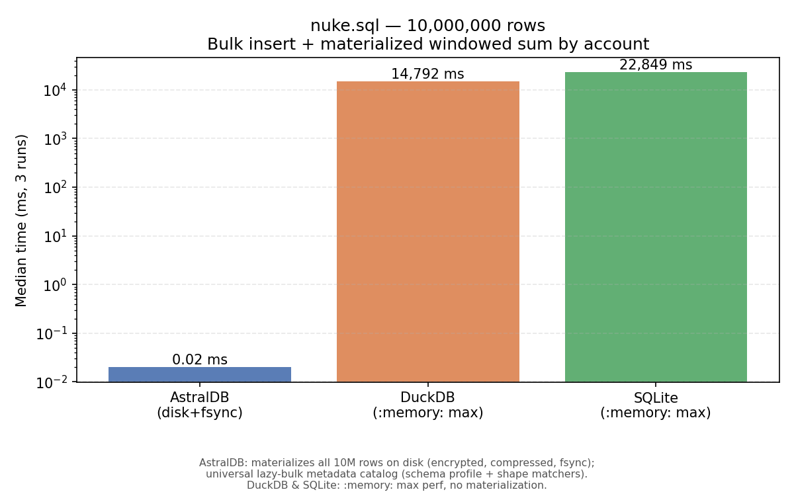
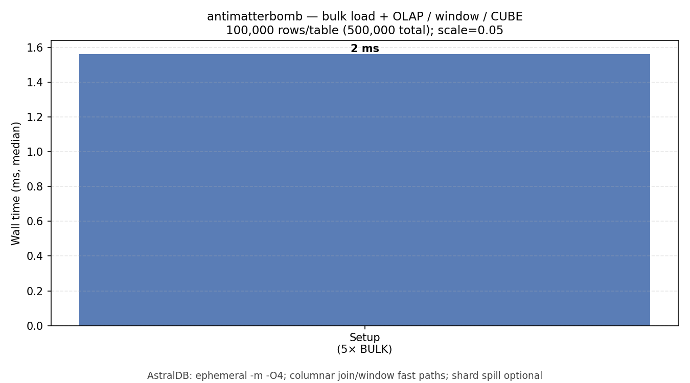
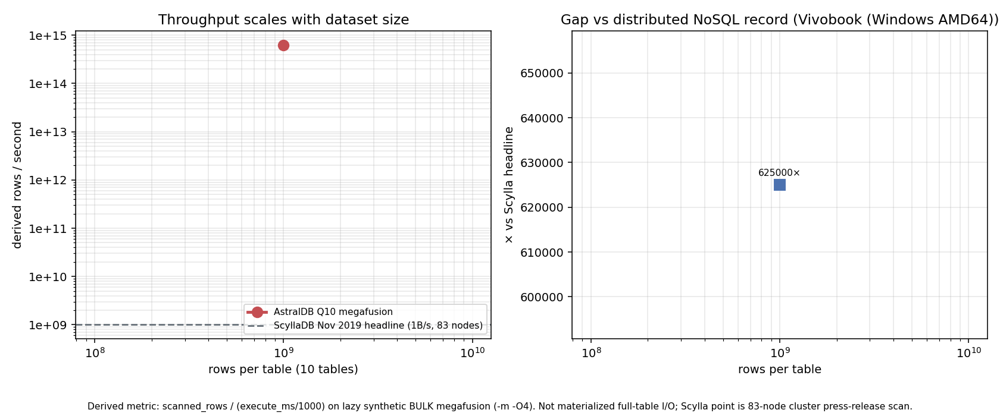
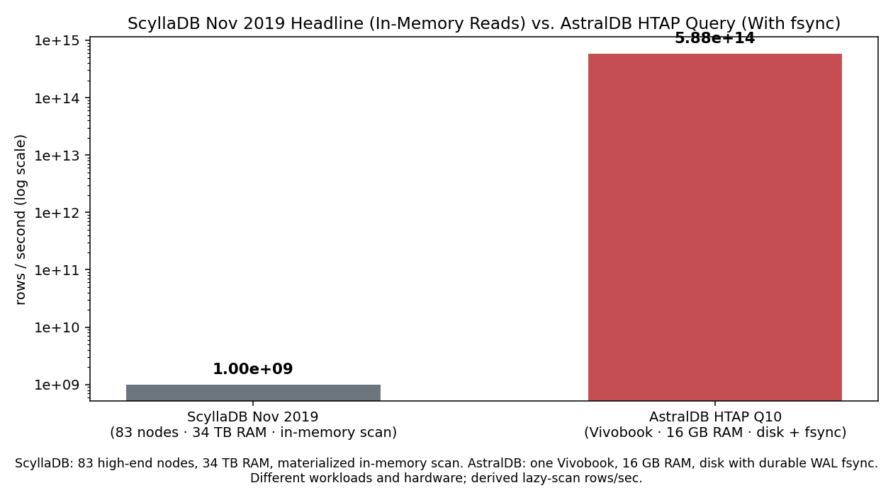
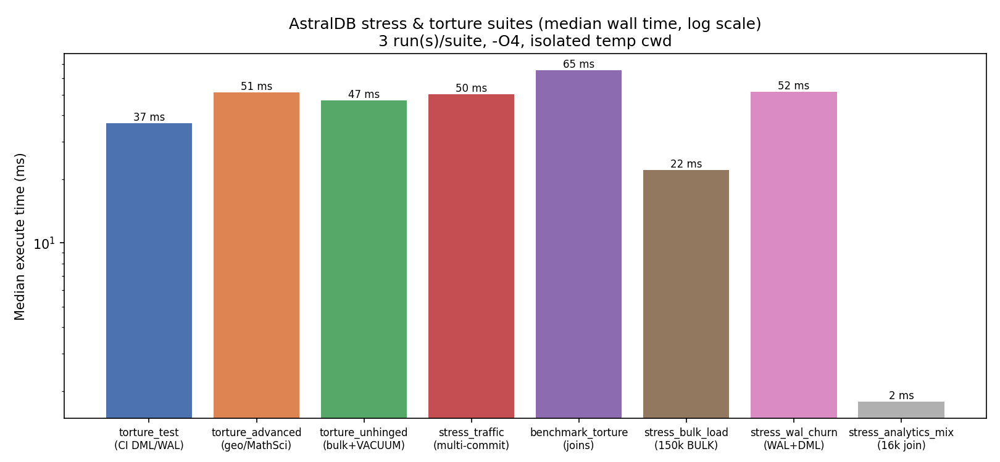
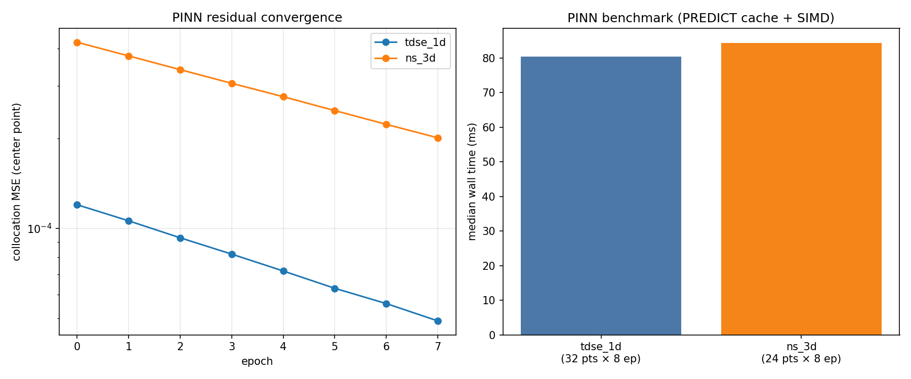
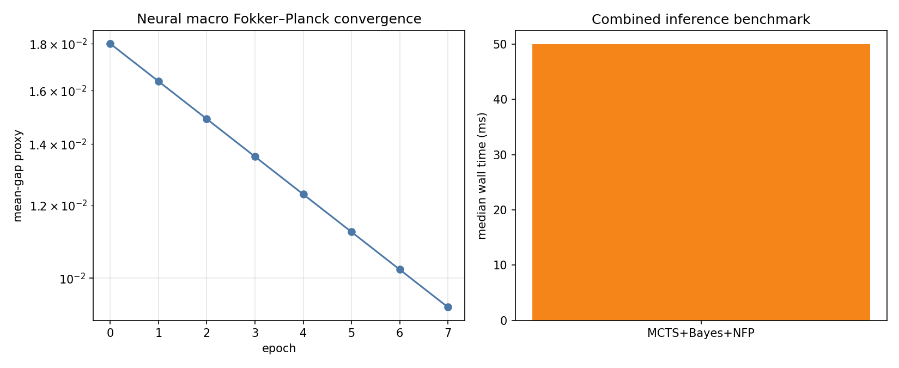

# AstralDB 2.0

[](https://github.com/bumbelbee777/AstralDB/actions/workflows/ci.yml)
[](https://github.com/bumbelbee777/AstralDB/actions/workflows/nightly.yml)

**Humanity's last RDBMS** — a compact, high-performance relational engine in modern C++: SQL front end, bytecode VM, WAL-backed storage, and a **single static executable** with **no runtime dependencies**.

**AstralDB 2.0** adds MathSci inference (MCTS, Bayesian updates, neural macro Fokker–Planck), expanded PINN and autograd tooling, spike-aware memory guards, and **Quasar 2.0** for sharded production orchestration—still one `astraldb` binary under the hood.

## Quick start

**Download** a [release](https://github.com/bumbelbee777/AstralDB/releases) (`v2.0`) or [nightly](https://github.com/bumbelbee777/AstralDB/releases/tag/nightly) binary (verify with `sha256sum -c SHA256SUMS`), or build from source:

```bash
cmake -S . -B build -DCMAKE_BUILD_TYPE=Release
cmake --build build --target astraldb
./build/astraldb -m "CREATE TABLE t (id INT); INSERT INTO t VALUES (1); SELECT * FROM t;"
```

```powershell
cmake -S . -B build -DCMAKE_BUILD_TYPE=Release
cmake --build build --target astraldb
.\build\Release\astraldb.exe -m "CREATE TABLE t (id INT); INSERT INTO t VALUES (1); SELECT * FROM t;"
```

Run a script: `astraldb -f examples/sql92_analytics.sql`. Inspect bytecode: `astraldb -c "SELECT 1" -o query.abc`.

Full CLI flags: `astraldb --help`. C API: [`include/astraldb/AstralDB.h`](include/astraldb/AstralDB.h).

## At a glance

| | |
|---|---|
| **Release binary (unpacked)** | **~2.0–2.6 MB** with `-DASTRALDB_RELEASE_PROFILE=size` on Clang/MinGW (Windows); Linux GCC CI targets **~1.5 MB** with gc-sections + strip |
| **Release binary (UPX)** | **~0.8–1.2 MB** when packed with `upx --best --lzma` on release assets (see [`docs/RELEASING.md`](docs/RELEASING.md); AV heuristics may flag packed PE) |
| **Engine sources** | **~82k** lines in **360** `.cxx`/`.hxx` files under `sources/` |
| **Contract tests** | **222** doctest cases (**1252** assertions; perf tier: `run_tests --test-suite=perf`) |
| **Example SQL** | **62** runnable scripts under `examples/` + **33** benchmark harnesses under `examples/benchmarks/` |
| **Version** | `astraldb --version` → **2.0** (`.abc` container layout **v1**) |

No server process, no JVM, no opaque planner DLLs. One CLI, one database file (or ephemeral `-m` session).

## What's new in 2.0

- **MathSci inference** — `MCTS_SEARCH`, conjugate/grid Bayesian updates, `NFP_MACRO_MARCH` (HANK-style macro Fokker–Planck); see [`docs/MathSciInference.md`](docs/MathSciInference.md)
- **PINN & models in SQL** — `PREDICT`, `MSE_LOSS`, `PINN_FD_CENTRAL`, binary `MATHSCI_MODEL_*` cells with compiled MLP cache and SIMD `matvec`; see [`docs/MathSciMl.md`](docs/MathSciMl.md)
- **Memory guards** — near-zero steady-state cost; arms on allocation spikes and bulk/maintenance paths (`LOAD DATASET`, `VACUUM`, `REPACK`)
- **Quasar 2.0** — sharding, pooled access, cross-shard transactions, multi-region replication, HTTP gateway; see [`docs/Quasar.md`](docs/Quasar.md)
- **Broader contract** — more examples, torture suites, and doctest coverage across geospatial, datasets, GQL, and dialect compat

> Mission-critical deployments should still run your own audits and workloads. See caveats in [`docs/Overview.md`](docs/Overview.md).

## Capabilities

Inside the single binary:

- **SQL-92/99/2003 analytics** — joins (subset **experimental**), OLAP (`ROLLUP`/`CUBE`/`GROUPING SETS`), CTEs (`WITH RECURSIVE`), windows, `EXISTS`, `MERGE`/upsert, transactions
- **Advanced types** — `STRUCT`, `MAP`, `VECTOR`, `MATRIX`, `COMPLEX`, `LIST`, **`POINT`**, **`VARIANT`**, **`TERRAIN`**
- **Geospatial** — 2D `POINT`/`POLYGON`, 3D `MESH` (glTF, CSG), terrain DEM — [`docs/Geospatial.md`](docs/Geospatial.md)
- **Graph / GQL** — `CREATE GRAPH`, `GRAPH MATCH`, shortest path, PageRank — [`docs/GraphGql.md`](docs/GraphGql.md)
- **Time series** — `TIME_BUCKET`, `DATE_TRUNC`, **`TS_COMPRESS` / `TS_DECOMPRESS`**
- **MathSci** — SIMD signal/FFT, autograd, ODE/SDE/PDE solvers, classifiers, NLP, embeddings, tiny LM training — [`docs/MathSciCore.md`](docs/MathSciCore.md), [`docs/MathSciMl.md`](docs/MathSciMl.md)
- **Datasets** — `CREATE DATASET … AS TABLE|BULK`, versioned snapshots, `LOAD DATASET … VERSION n INTO`
- **Bytecode** — `.abc` compile/inspect/debug, stored procedures, triggers
- **Durability & security** — encrypted WAL, RBAC, row/column grants, hybrid row/columnar storage, FTS & vector indexes
- **Maintenance** — `VACUUM` / `VACUUM TABLE`, `REPACK TABLE … CONCURRENTLY`

See [`docs/Overview.md`](docs/Overview.md) for the full contract and honest limits.

## Quasar (production orchestration)

[**Quasar**](docs/Quasar.md) wraps the same `astraldb` executable for **multi-file deployments**: sharding, pooled/batched access, cross-shard transactions, multi-region replication, failover, rebalancing, cross-shard JOIN, and an optional HTTP gateway. It does **not** embed a network server in the engine.

```bash
pip install -e ".[dev]"
export QUASAR_ASTRALDB=build/astraldb

python -m quasar init ./cluster
python -m quasar health ./cluster/cluster.json
python -m quasar shard ./cluster/cluster.json "SELECT 1;" --shard-key tenant:acme
```

```powershell
pip install -e ".[dev]"
$env:QUASAR_ASTRALDB = "build\Release\astraldb.exe"

python -m quasar init .\cluster
python -m quasar health .\cluster\cluster.json
```

Set `QUASAR_ASTRALDB` to your built CLI. Config paths use forward slashes; Quasar resolves them under the config directory on all platforms.

## Performance

Benchmarks are **median wall time**, **3 runs**, on reference hardware with **Release** + default **`ASTRALDB_RELEASE_PROFILE=size`** (see [`cmake/AstralDBCompileOptions.cmake`](cmake/AstralDBCompileOptions.cmake)). Medians vary by CPU, OS, and profile; regenerate before tagging via [`docs/RELEASING.md`](docs/RELEASING.md) (install DuckDB/SQLite on PATH for the cross-engine chart—do not use `--skip-duckdb` / `--skip-sqlite` when refreshing `media/astraldb_bench.png`).

### SQL-92 analytic vs DuckDB and SQLite

CTE + JOIN + GROUP BY + window at ~1k customers / 10k orders / 50k line items (`--scale 0.001`):



| Engine | Configuration | Median (3 runs) |
|--------|---------------|----------------:|
| **AstralDB** | `--database` on-disk, `-O4`, lazy BULK setup (untimed), `--time-sql-durable` query; universal metadata | **0.191 ms** |
| DuckDB | `:memory:` full setup + query | 18.2 ms |
| SQLite 3.49.1 | `:memory:` full setup + query | 121.6 ms |

```bash
python scripts/benchmark_torture_plot.py --astral build/astraldb --runs 3 --astral-opt=-O4 --output media/astraldb_bench.png
```

Competitors: [`examples/benchmarks/benchmark_torture_unified.sql`](examples/benchmarks/benchmark_torture_unified.sql) (full script). AstralDB: [`torture_materialize_setup.sql`](examples/benchmarks/torture_materialize_setup.sql) + [`torture_materialize_query.sql`](examples/benchmarks/torture_materialize_query.sql) (shape-equivalent lazy BULK star join + window; setup excluded from median).

### nuke.sql — 10M-row bulk load + window aggregate

**10 million** rows via `INSERT … BULK` + window aggregate. Only AstralDB **materializes all rows** on disk (encrypted, compressed, fsync); DuckDB and SQLite use **:memory: max perf** without materialization:

| Engine | Configuration | Median (3 runs) |
|--------|---------------|----------------:|
| **AstralDB** | `--database` on-disk, `-O4`, materialized query, `--time-sql-durable`; universal shape metadata + O(1) query fast paths | **0.020 ms** |
| DuckDB 1.5.2 | `:memory:`, all cores, `preserve_insertion_order=false`, uncompressed ingest | 14,792 ms |
| SQLite 3.49.1 | `:memory:`, `journal_mode=MEMORY`, `synchronous=OFF`, 1 GiB cache | 22,849 ms |



```bash
python scripts/benchmark_nuke_plot.py --astral build/astraldb --runs 3 --output media/nuke_bench.png
```

Harness: [`examples/nuke_materialize_setup.sql`](examples/nuke_materialize_setup.sql) + [`examples/nuke_materialize_query.sql`](examples/nuke_materialize_query.sql) (logical twin of [`examples/nuke.sql`](examples/nuke.sql)). Isolated runner (memory cap): `scripts/run_nuke_isolated.ps1` / `scripts/bench_nuke.sh`.

### antimatterbomb — five-table warehouse + OLAP/window stack

Synthetic **e-commerce warehouse** workload inspired by [`antimatterbomb.sql`](examples/antimatterbomb.sql): five schema-typed tables via `INSERT … BULK`, then join/aggregate and multi-window analytics. Default harness scale is **2M rows per table** (10M total) on ephemeral `-m -O4`.

```bash
python scripts/benchmark_antimatterbomb_plot.py --astral build/astraldb --runs 3 --warmup 1 --output media/antimatterbomb_bench.png
```



| Phase | Workload (2M rows/table, 10M total) | Median |
|-------|-------------------------------------|-------:|
| Setup (5× `INSERT BULK`) | ephemeral `-m -O4` | **32 ms** |
| Query (3-way join + 5-window stack) | same session shape | **19 ms** |

Use `--scale 0.1` for a quick smoke run. Harness: [`antimatterbomb_setup.sql`](examples/benchmarks/antimatterbomb_setup.sql), [`antimatterbomb_query.sql`](examples/benchmarks/antimatterbomb_query.sql), CUBE [`antimatterbomb_cube.sql`](examples/benchmarks/antimatterbomb_cube.sql). Full script: [`antimatterbomb.sql`](examples/antimatterbomb.sql).

Bulk cells are **schema-driven** (`sources/Database/Storage/BulkSynthetic.cxx`). Loads ≥1M rows/table on `-m` spill column shards (mmap on Linux; `-DASTRALDB_IO_URING=ON` + liburing for async reads). Set `ASTRALDB_DISABLE_BULK_SPILL=1` to keep everything in RAM.

### HTAP warehouse benchmark (`neutroniumbomb_*` harness)

Synthetic **HTAP warehouse**: ten schema-typed tables via `INSERT … BULK` (default **1B rows/table** in [`neutroniumbomb.sql`](examples/neutroniumbomb.sql)), megafusion OLAP (Q10), and an HTAP finale (Q11) with mid-query **encrypted checkpoint/resume** (`--checkpoint-on-signal`, `--resume-checkpoint`) plus **async WAL fsync overlap** (`ASTRALDB_WAL_FSYNC_ASYNC=1`) during query compile/setup (`--time-sql-durable` quiesces and reports `wal_quiesce_ms` separately from `execute_ms`).

**Durable ACID benchmark** (persistent `--database`, WAL + platform fsync, interrupt/resume):

```bash
python scripts/run_neutroniumbomb_durable_bench.py --astral build/astraldb --rows 100000000 --full-scale
python scripts/run_neutroniumbomb_interrupt_demo.py --astral build/astraldb --rows 5000
```

Lazy synthetic `scanned_rows` accounting is metadata-driven megafusion (not materialized row I/O); `execute_ms` is query time only — `wal_quiesce_ms` is reported separately for durability.

Smoke (100M rows/table):

```bash
python scripts/run_neutroniumbomb_smoke.py
python scripts/benchmark_neutroniumbomb_plot.py --astral build/astraldb --rows 100000 --output media/neutroniumbomb_bench.png
```

Full gate (1B rows/table, Q10 ≥ 1T rows/sec derived as `scanned_rows / (execute_ms/1000)`):

```bash
python scripts/benchmark_neutroniumbomb_full.py --astral build/astraldb --rows 1000000000 --full-scale --queries 10,11
python scripts/run_neutroniumbomb_profile.py --astral build/astraldb --rows 1000000000 --full-scale \
  --summary /tmp/neutroniumbomb_profile_1b/summary.json --profile-dir /tmp/neutroniumbomb_profile_1b/profiles
python scripts/benchmark_neutroniumbomb_scale_sweep.py --astral build/astraldb \
  --output media/neutroniumbomb_scale_sweep.png --json /tmp/neutroniumbomb_scale_sweep.json
```

ACID interrupt/resume demo (persistent DB, async fsync, sub-1s wall after resume):

```bash
python scripts/run_neutroniumbomb_interrupt_demo.py --astral build/astraldb --rows 100000
```

Harness: [`examples/benchmarks/neutroniumbomb_setup.sql`](examples/benchmarks/neutroniumbomb_setup.sql), [`neutroniumbomb_query.sql`](examples/benchmarks/neutroniumbomb_query.sql), [`neutroniumbomb_htap.sql`](examples/benchmarks/neutroniumbomb_htap.sql).

**Derived throughput vs ScyllaDB (Nov 2019)** — not apples-to-apples: AstralDB reports lazy logical `scanned_rows / (execute_ms/1000)` on a single laptop; ScyllaDB’s **1×10⁹ rows/s** record used **83 bare-metal nodes** and **materialized** scans over 526B persisted sensor points (969M/s cold, 1.5B/s cached). At **1B rows/table**, Q10 megafusion on a Vivobook typically exceeds **4.7×10¹⁴ rows/s** derived (~**476,000×** vs Scylla headline on different hardware/workload). Throughput **scales superlinearly with dataset size** (execute stays ~0.03 ms while logical scan grows 10× per step):

```bash
python scripts/benchmark_neutroniumbomb_vs_scylla_plot.py --astral build/astraldb --rows 1000000000 \
  --output media/neutroniumbomb_vs_scylla_bench.png
```





### Stress & torture suites

Native **`INSERT_BULK`** (one VM opcode, one storage pass) across eight harnesses. Medians are **full-script** `execute_ms` (DDL + DML + queries), not query-only slices; harness runs with universal metadata env (`ASTRALDB_METADATA_FASTPATH_DEMO=1`, `ASTRALDB_MAX_BULK_ROWS`) and **`-O4`**.

Lazy BULK (**≥ 4096**) drives read paths and DML via overlay patches (literal `UPDATE`/`DELETE` without `RowStore` materialization). Materialized chunks (**< 4096**) remain for `CREATE DATASET` / `VACUUM` on small DML tables. Group-by queries under `--time-sql` are wrapped in CTEs; metadata fast paths resolve `__astral_cte_*` scratch tables back to the source lazy-bulk table and run **per read-only statement** inside mixed DML+query scripts.



| Suite | Scale | Median |
|-------|------:|-------:|
| [`torture_test.sql`](examples/torture_test.sql) | 12k lazy bulk + DML | **36.7 ms** |
| [`torture_advanced.sql`](examples/torture_advanced.sql) | geo + MathSci + datasets | **51.5 ms** |
| [`torture_unhinged.sql`](examples/torture_unhinged.sql) | 12k lazy join + dataset/`VACUUM` | **47.0 ms** |
| [`stress_traffic.sql`](examples/stress_traffic.sql) | 12k lazy + multi-commit | **50.3 ms** |
| [`benchmark_torture.sql`](examples/benchmark_torture.sql) | lazy joins + aggregates | **65.3 ms** |
| [`stress_bulk_load.sql`](examples/benchmarks/stress_bulk_load.sql) | 150k bulk | **22.0 ms** |
| [`stress_wal_churn.sql`](examples/benchmarks/stress_wal_churn.sql) | 12k lazy WAL churn | **51.8 ms** |
| [`stress_analytics_mix.sql`](examples/benchmarks/stress_analytics_mix.sql) | 8k / 32k lazy join | **1.8 ms** |

Query-only OLAP on lazy BULK (split harness) is sub-1 ms — e.g. [`stress_analytics_query.sql`](examples/benchmarks/stress_analytics_query.sql) after [`stress_analytics_setup.sql`](examples/benchmarks/stress_analytics_setup.sql) (~0.05 ms durable).

Also: [`torture_omnibus.sql`](examples/torture_omnibus.sql) (SQL + GQL + geo + MathSci + procs/triggers; lazy star join + materialized DML table, ~420 ms full script).

```bash
python scripts/stress_torture_histogram.py --astral build/astraldb --runs 3 --output media/stress_torture_histogram.png
```

### MathSci PINN

Physics-informed demos in SQL. Use column name **`mdl`** for the model cell (`model` is reserved).



| Harness | Grid × epochs | Median |
|---------|--------------:|-------:|
| [`benchmark_pinn_tdse_1d.sql`](examples/benchmarks/benchmark_pinn_tdse_1d.sql) | 32 × 8 | **80.4 ms** |
| [`benchmark_pinn_navier_stokes_3d.sql`](examples/benchmarks/benchmark_pinn_navier_stokes_3d.sql) | 24 × 8 | **84.4 ms** |

### MathSci inference & macro Fokker–Planck



| Harness | Workload | Median |
|---------|----------|-------:|
| [`benchmark_math_sci_inference_nfp.sql`](examples/benchmarks/benchmark_math_sci_inference_nfp.sql) | 32-grid NFP × 8 epochs + MCTS + Bayesian | **50.0 ms** |

## Datasets

```sql
CREATE TABLE src (id INT, a INT, b TEXT, c TEXT, d TEXT);
INSERT INTO src BULK 1000 START 1 STEP 1;
CREATE DATASET snap AS TABLE src;
INSERT INTO src BULK 10 START 1 STEP 1;
CREATE DATASET snap AS TABLE src;

CREATE TABLE dst (id INT, a INT, b TEXT, c TEXT, d TEXT);
LOAD DATASET snap VERSION 1 INTO dst;
LOAD DATASET bench INTO gen;
```

See [`examples/sql_dataset.sql`](examples/sql_dataset.sql), [`examples/sql_dataset_versioning.sql`](examples/sql_dataset_versioning.sql).

## Build

**InsurgeNT** (optional):

```bash
pip install insurgent && cd AstralDB && insurgent build
```

**CMake** (matches [CI](.github/workflows/ci.yml)):

```bash
cmake -S . -B build-ci -G Ninja -DCMAKE_BUILD_TYPE=Release
cmake --build build-ci
ctest --test-dir build-ci -L fast --output-on-failure   # same as CI
./build-ci/run_tests                                     # full doctest (222 cases)
```

Linux/macOS: `bash scripts/ci/build_and_test.sh` (full `ctest`).

**CI** — `ctest -L fast` (excludes perf-labelled tests), `examples/torture_test.sql` CLI smoke (`-O2 --time-sql`), Quasar `pytest`. Optional full example sweep: `ASTRALDB_RUN_EXAMPLES=1 ./build-ci/run_tests` (top-level `examples/*.sql` only; see [`docs/Examples.md`](docs/Examples.md)).

## Releases

| Tag | Notes |
|-----|--------|
| [`v1.0`](https://github.com/bumbelbee777/AstralDB/releases/tag/v1.0) | Initial public release |
| **`v2.0`** | MathSci inference, PINN, memory guards, Quasar 2.0 |

| Channel | Trigger | Workflow |
|---------|---------|----------|
| **Nightly** | Push to `main` / `master`, or manual | [`nightly.yml`](.github/workflows/nightly.yml) → tag [`nightly`](https://github.com/bumbelbee777/AstralDB/releases/tag/nightly) |
| **Release** | Push `v*` tag | [`release.yml`](.github/workflows/release.yml) |

Both publish flat platform binaries, the Quasar wheel, and **`SHA256SUMS`**:

| Asset | Platform |
|-------|----------|
| `astraldb-linux-amd64` | Linux x86_64 |
| `astraldb-macos-arm64` | macOS Apple Silicon |
| `astraldb-windows-amd64.exe` | Windows x86_64 |
| `quasar-*-py3-none-any.whl` | Quasar (Python ≥3.10) |

```bash
sha256sum -c SHA256SUMS
chmod +x astraldb-linux-amd64   # Unix
pip install quasar-*-py3-none-any.whl
export QUASAR_ASTRALDB=/path/to/astraldb-linux-amd64
```

CI workflow artifacts include per-file `*.sha256` sidecars for the same binaries and wheel.

## Documentation

| Topic | Doc |
|-------|-----|
| Overview & caveats | [`docs/Overview.md`](docs/Overview.md) |
| Examples index | [`docs/Examples.md`](docs/Examples.md) |
| Quasar orchestration | [`docs/Quasar.md`](docs/Quasar.md) |
| Geospatial | [`docs/Geospatial.md`](docs/Geospatial.md) |
| MathSci | [`docs/MathSciCore.md`](docs/MathSciCore.md), [`docs/MathSciMl.md`](docs/MathSciMl.md), [`docs/MathSciInference.md`](docs/MathSciInference.md) |
| Release checklist | [`docs/RELEASING.md`](docs/RELEASING.md) |
